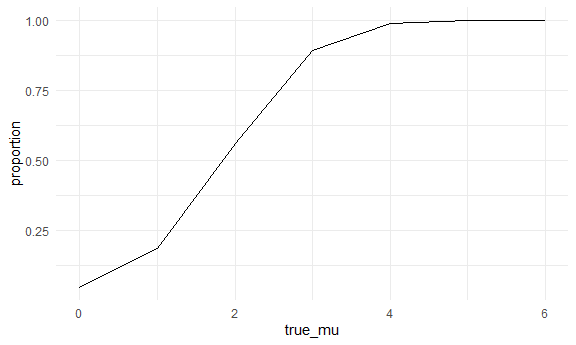
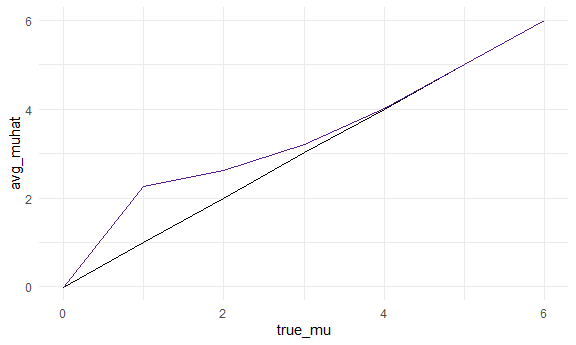

Homework 5
================
Lily Wang
11/10/2020

## Problem 1

The homicide dataset contains information gathered by the *Washington
Post* on homicides in 50 major US cities. The dataset contains
information such as the victim’s name, age, race, sex, location, and
whether or not an arrest was made.

Reading and cleaning the homicide data:

``` r
homicide_df <-
  read_csv("homicide_data/homicide-data.csv") %>% 
  mutate(
    city_state = str_c(city, state, sep = "_"),
    resolved = case_when(
      disposition == "Closed without arrest" ~ "unsolved",
      disposition == "Closed by arrest" ~ "solved",
      disposition == "Open/No arrest" ~ "unsolved")
    ) %>% 
  select(city_state, resolved) %>% 
  filter(city_state != "Tulsa_AL")
```

Get total unsolved homicides and total homicides for each city, then
perform prop test on Baltimore, MD:

``` r
aggregate_df <- homicide_df %>% 
  group_by(city_state) %>% 
  summarize(
    hom_total = n(),
    hom_unsolved = sum(resolved == "unsolved")
  )
```

    ## `summarise()` ungrouping output (override with `.groups` argument)

``` r
prop.test(aggregate_df %>% filter(city_state == "Baltimore_MD") %>% pull(hom_unsolved), 
          aggregate_df %>% filter(city_state == "Baltimore_MD") %>% pull(hom_total)) %>% 
  broom::tidy()
```

    ## # A tibble: 1 x 8
    ##   estimate statistic  p.value parameter conf.low conf.high method    alternative
    ##      <dbl>     <dbl>    <dbl>     <int>    <dbl>     <dbl> <chr>     <chr>      
    ## 1    0.646      239. 6.46e-54         1    0.628     0.663 1-sample~ two.sided

Iterate through all the cities:

``` r
results_df <- aggregate_df %>% 
  mutate(
    prop_tests = map2(.x = hom_unsolved, .y = hom_total, ~prop.test(x = .x, n = .y)),
    tidy_tests = map(.x = prop_tests, ~broom::tidy(.x))
  ) %>% 
  select(-prop_tests) %>% 
  unnest(tidy_tests) %>% 
  select(city_state, estimate, conf.low, conf.high)
```

Make a plot to display the proportion of unsolved homicides (+-
confidence interval) in all the cities from lowest to highest:

``` r
results_df %>% 
  mutate(city_state = fct_reorder(city_state, estimate)) %>% 
  ggplot(aes(x = city_state, y = estimate)) + 
  geom_point() +
  geom_errorbar(aes(ymin = conf.low, ymax = conf.high)) +
  theme(axis.text.x = element_text(angle = 90, vjust = 0.5, hjust=1))
```


## Problem 2

Read in all csv’s and tidying the result to include an `id` and `arm`
variable:

``` r
longitudinal_df <- 
  tibble(
    path = list.files("longitudinal_data")) %>% 
  mutate(path = str_c("longitudinal_data/", path),
         data = map(.x = path, ~read_csv(.x))) %>% 
  unnest(data) %>% 
  mutate(id = str_extract(path, "\\d+"),
         id = as.numeric(id),
         arm = str_extract(path, "con|exp")) %>% 
  relocate(id, arm, path,everything()) %>% 
  mutate(arm = recode(arm, con = "control", exp = "experimental")) %>% 
  pivot_longer(week_1:week_8,
               names_to = "week",
               names_prefix = "week_",
               values_to = "value")
```

Make a spaghetti plot to display the results over time for each subject:

``` r
longitudinal_df %>% 
  ggplot(aes(x = week, y = value, group = id, color = arm)) +
  geom_path()
```


The control group seemed to stay pretty consistent (if not slightly
decrease) in their values over the 8 weeks, while the experimental
group’s values seemed to increase over the 8 weeks.

## Problem 3

Generate 5000 datasets with n = 30, mu = 0, and sigma = 5, then extract
their means and p-values:

``` r
set.seed(3)

sim_mean_t <- function(n = 30, mu, sigma = 5) {
  
  sim_data = tibble(
    x = rnorm(n = n, mean = mu, sd = sigma))
  
  sim_data %>% 
    summarize(mu_hat = mean(x),
              p_value = t.test(x) %>% broom::tidy() %>% pull(p.value))
}

sim_results <-
  rerun(5000, sim_mean_t(mu = 0)) %>% 
  bind_rows()
```

Repeat this but for mu = {0,1,2,3,4,5,6}:

``` r
sim_results <- 
  tibble(true_mu = c(0:6)) %>% 
  mutate(
    output_lists = map(.x = true_mu, ~rerun(5000, sim_mean_t(mu = .x))),
    estimate_dfs = map(output_lists, bind_rows)) %>% 
  select(-output_lists) %>% 
  unnest(estimate_dfs)
```

Make a plot showing the proportion of times the null was rejected (the
power of the test) on the y-axis and the true value of
 on the
x-axis:

``` r
sim_results %>%
  group_by(true_mu) %>% 
  summarize(
    total = n(),
    rejected = sum(p_value < 0.05)) %>% 
  mutate(proportion = rejected / total) %>% 
  ggplot(aes(x = true_mu, y = proportion)) +
  geom_point() +
  geom_smooth(se = FALSE)
```

    ## `summarise()` ungrouping output (override with `.groups` argument)

    ## `geom_smooth()` using method = 'loess' and formula 'y ~ x'



It seems that as effect size increases, so does power.

Make a plot showing the average estimate of 
on the y-axis and the true value of
 on the
x-axis. Overlay a second plot of the average estimate of 
only in samples for which the null was rejected:

``` r
rejected_muhat <- 
  sim_results %>% 
  filter(p_value < 0.05) %>% 
  group_by(true_mu) %>% 
  summarize(avg_muhat = mean(mu_hat))
```

    ## `summarise()` ungrouping output (override with `.groups` argument)

``` r
sim_results %>% 
  group_by(true_mu) %>% 
  summarize(avg_muhat = mean(mu_hat)) %>% 
  ggplot(aes(x = true_mu, y = avg_muhat)) +
  geom_point() +
  geom_point(data = rejected_muhat, 
             color = "purple")
```

    ## `summarise()` ungrouping output (override with `.groups` argument)


